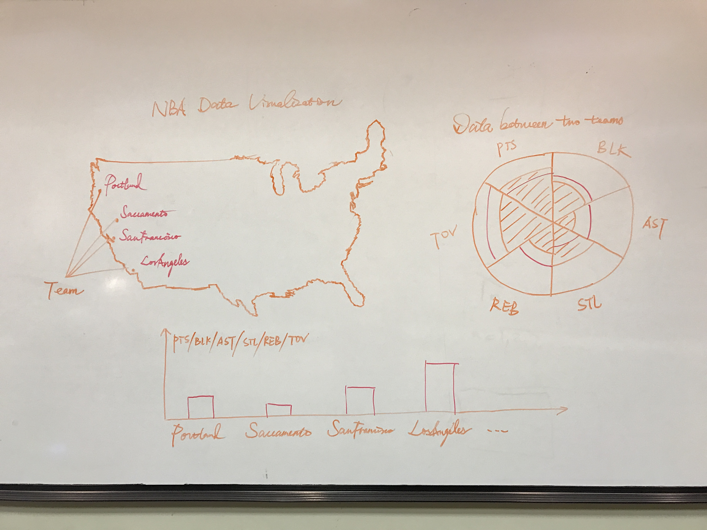
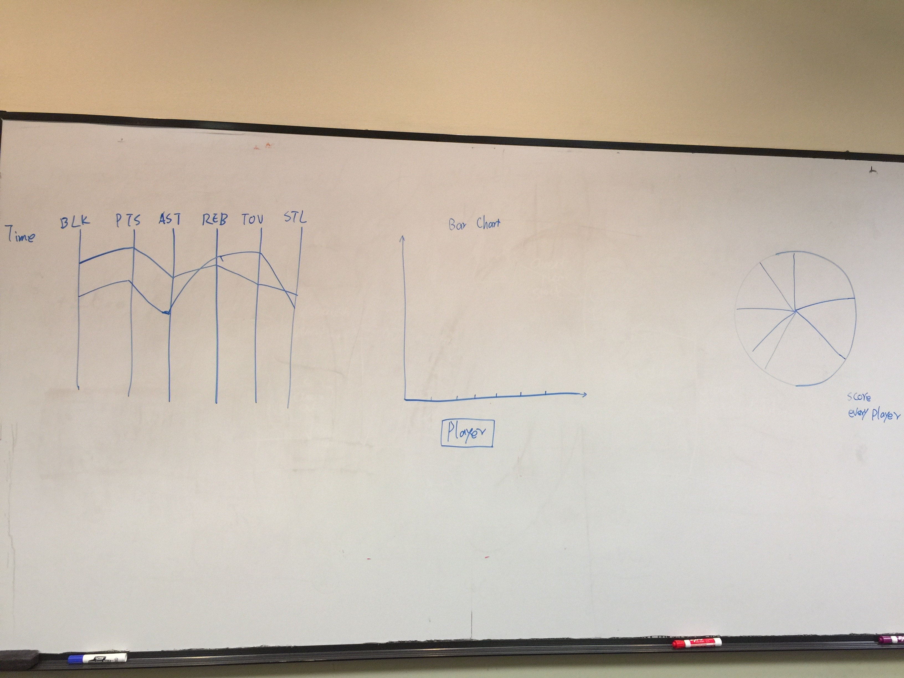
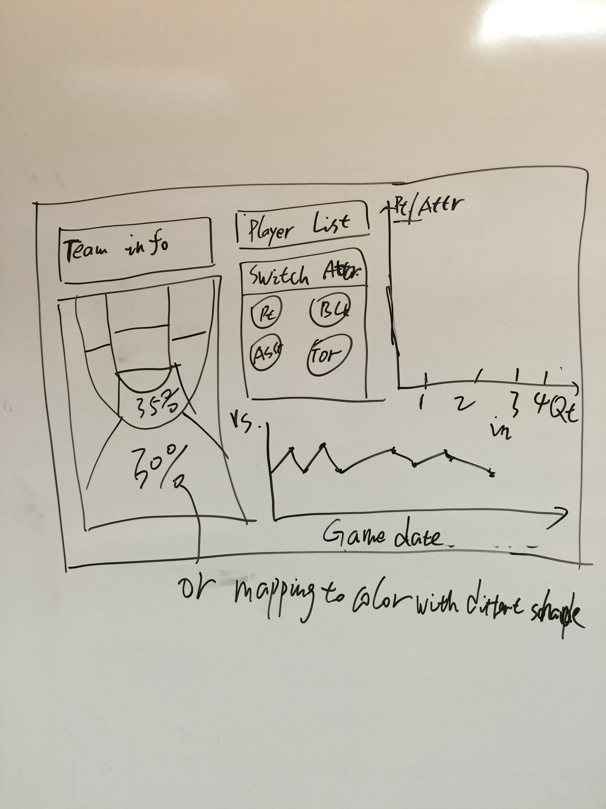
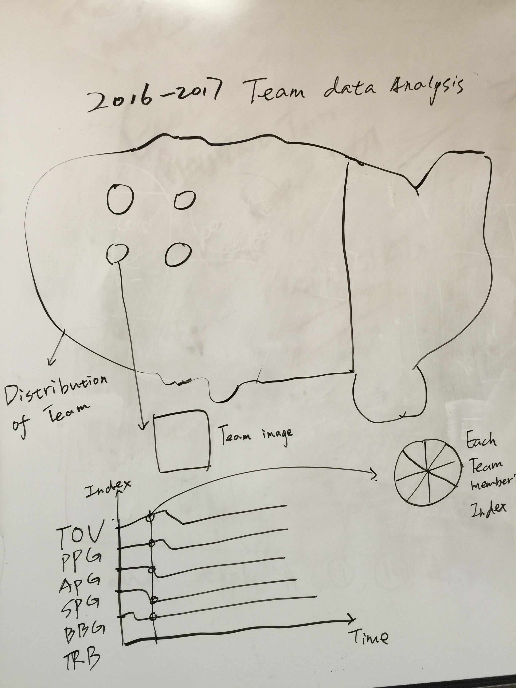

# DataVisFinal 17S

## Basic Info

Project Title: Boston Celtics Data Analysis in 2016

Team Members : Zhixiang Yang, Feng Zheng, Sishi Hao, Jiaxin Lyu.

E-mail Address : zyang9@wpi.edu, fzheng@wpi.edu, shao@wpi.edu, jlyu3@wpi.edu

GitHub ID: oliver2121, vigraythorn, SishiHao, Charlotte1125

Link to Project repo: https://github.com/oliver2121/17S_DataVisFinal

## Background and Motivation

NBA is widely considered to be the premier men's professional basketball league in the world. It has 30 teams and is considered as the national governing body for basketball in the United States. The Boston Celtics are an American professional basketball team based in Boston. As a percentage of championships won, the Celtics are the most successful franchise to date in the major four traditional North American professional sports leagues.

Since we live near Boston, we're really interested in the Boston Celtics. We're going to create a data visualization to analyze performance of Boston Celtics. By analyzing our data visualization, people will get a full understanding of this team and each player in this team.

## Project Objectives
Our project mainly focus on giving a comprehensively analysis of Boston Celtics basketball team and its player in order to understand the advantages of this team and find out each team player’s potential. Since data analysis has become an irreplaceable status in estimating each player’s ability and decision making, the display of the data turns out to be important. We decide to show six index of the team including TOV, RPG, APG, SPG, BPG and PPG in every game which support in analyzing overall performance of the team. For the people who are interested in specific player, it will also show each team player’s ability index and general performance in the whole season.

## Data

We collect data we need from the website below:

http://basketball.realgm.com/nba/stats

## Data Processing

We will eliminate some attributes we don't need to do visualization from the dataset. We hope to get around 1,000 rows of data for our analysis purpose. The data will be processing by excel.

## Visualization Design

Feng Zheng:

I designed a map of United States with 30 teams of the East and the West. The logo of each team is shown on the map. With the mouse click of the team, the team’s data is listed on the chart on the right side. We can see the points, assists, rebounds, blocks, steals and turnovers of two teams in one game. Below the map is an overall data of the 30 teams. By using a switch we can see the different data of all the teams.

SishiHao:

There are three charts: line chart, bar chart and pie chart. In the line chart, you can see six kinds of data of each game and also you can see the trends of the data. When you click on particular game, the pie chart will show scores contributed by each player, which will be shown in different color. And if you would like to know information about one player of this game, you can click on the player in pie chart and all of the data will be shown in the bar chart. What's more, if you want to know the trends in one period, you can select that period in the line chart, the line chart will show the six kinds of data in that period.

Zhixiang Yang:

In Zhixiang's initial design sketch, he consider a heating map in court to show the percentage of shooting ratio is pretty important. And a bar chart could be used for display the player performance in different quarter in season. In the bottom of the page we could use a line chart to show the player performance trend in whole season and compare with other players.

JiaxinLyu:

For visulization design, I design a USA map which contains the distribution of all basketball teams in USA. When your mouse move on the dot in the map, it will display team's logo. Beside the map, it will show a bar chart which will record team 's performance including six index for every match in this season. In addition to this, when you click each match, It will show six pie chart for each index which include fifteen team member's ability index.

Summery:

After we discussed of those prototype designs we decide we opt to focus on a single team which is Boston Celtics to do the visualization analysis. We will pick up design idea from those sketches and make it a whole.

## Must-Have Features

- 1. Pick a player to see the whole season average data trend.
- 2. Pick a player to see his performance to different opponents in timeline.
- 3. Show  the team performance data in whole season.

## Optional Features

- 1. Show a heat map of filed goals percentage in court map.
- 2. Show a geo map of different opponents with match stats.

## Project Schedule

2/1-2/14: Planning project subject

2/14-2/16: Data collecting and processing

2/15: Documenting project proposal

2/16-2/17: Feedback reviewing

2/18-2/22: Data Visualization

2/23: Demo presentation

2/24-2/28: Refining data visualization

2/27: Film making

3/1: Final version of project
