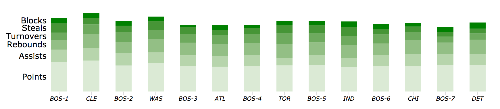
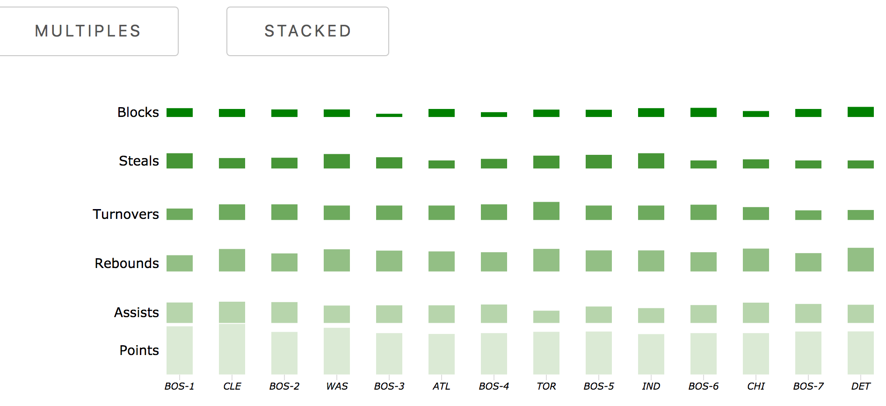
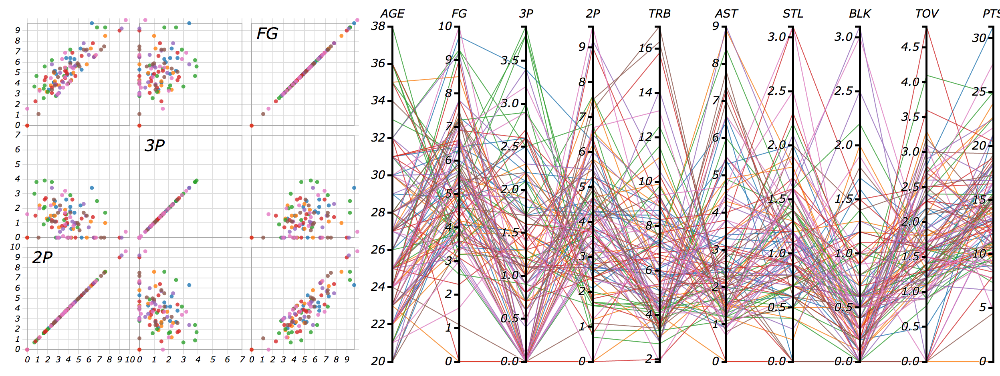

# DataVisFinal 17S

## Basic Info

Project Title: Boston Celtics Data Analysis in 2016

Team Members : Zhixiang Yang, Feng Zheng, Sishi Hao, Jiaxin Lyu.

E-mail Address : zyang9@wpi.edu, fzheng@wpi.edu, shao@wpi.edu, jlyu3@wpi.edu

GitHub ID: oliver2121, vigraythorn, SishiHao, Charlotte1125

Link to Project repo: https://github.com/oliver2121/17S_DataVisFinal

## Background and Motivation

NBA is widely considered to be the premier men's professional basketball league in the world. It has 30 teams and is considered as the national governing body for basketball in the United States. The Boston Celtics are an American professional basketball team based in Boston. As a percentage of championships won, the Celtics are the most successful franchise to date in the major four traditional North American professional sports leagues.

Since we live near Boston, we're really interested in the Boston Celtics. We're going to create a data visualization to analyze performance of Boston Celtics. By analyzing our data visualization, people will get a full understanding of this team and each player in this team.

## Project Objectives
Our project mainly focus on giving a comprehensively analysis of Boston Celtics basketball team and its player in order to understand the advantages of this team and find out each team player’s potential. Since data analysis has become an irreplaceable status in estimating each player’s ability and decision making, the display of the data turns out to be important. We decide to show six index of the team including TOV, RPG, APG, SPG, BPG and PPG in every game which support in analyzing overall performance of the team. For the people who are interested in specific player, it will also show each team player’s ability index and general performance in the whole season.

## Data

We collect data we need from the website below:

http://basketball.realgm.com/nba/stats

## Data Processing

Combine  multiple piece of data, Filter unnecessary data attribute,Calculate average performance between celtics and its opponent, Adjust the data format and document format  

## Visualization Design

## Team performance
We discover that we can take advantages of multiple bar to display six attributes in one team. At the same time,by stacking six bar, it is easy for us to identify overall performance between celtics and its opponent. 

## Position performance
We take advantages of drop down list to select the team and discover team performance in each position. Fans are likely to identify the advantages and drawbacks of each team.

## Player performance
We figure out that we can take advantages of filter function so that users can search condition by using the mouse to brush the parallel axis to filter the players you want to see.

